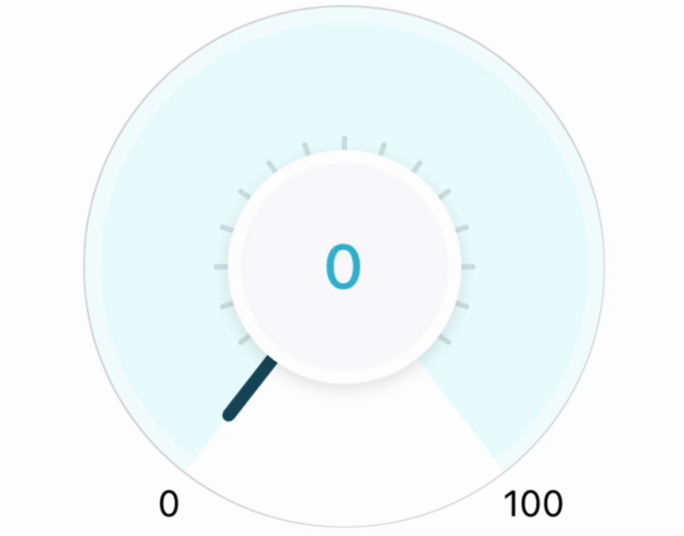

## 🌈 Gradient Arc Progress Indicator

An arc shaped progress indicator component that visually communicates user's progress within a customizable range using beautiful gradients. The progress is displayed between the provided minimum and maximum values.

## :film_projector: Demo

<p align="center">

</p>

## :man_technologist: Technology Stack

[](https://reactnative.dev/)
[](https://www.npmjs.com/package/react-native-svg)

## :hatching_chick: Prerequisites

You can choose either one of the following steps:

#### 1. Automatic setup using volta

- [Install volta](https://volta.sh/) and it will automatically start using the appropriate node and pnpm version for you

#### 2. Manual install

- [node](https://nodejs.org/en/) = 20.10.0
- [pnpm](https://pnpm.io/) = 8.15.2

## :zap: Installation

1. Clone / Download [this repo](https://github.com/khusharth/gradient-arc-progress-indicator).
2. Inside the project open a terminal and run:

   ```
   pnpm install
   ```

   This will install all the project dependencies.

3. To start the development server run:
   ```
   pnpm start
   ```

### Running on a Physical Android or iOS device

4. Install the [Expo Go app](https://expo.dev/client) on your iOS or Android phone and connect to the same wireless network as your computer.

   - On Android, use the Expo Go app to scan the QR code from your terminal to open your project.
   - On iOS, use the built-in QR code scanner of the default iOS Camera app.

OR

### Running on a Simulator or Virtual device

4. If you want to run the same on a simulator or virtual device, you can setup the same using the [steps mentioned in the react native docs](https://reactnative.dev/docs/environment-setup?package-manager=yarn&guide=native).

5. For iOS run `pnpm run ios` to start the iOS simulator and for Android run `pnpm run android` to start the Android simulator

## :man_in_tuxedo: Author

[](https://twitter.com/khusharth19)

[](https://www.linkedin.com/in/khusharth/)
